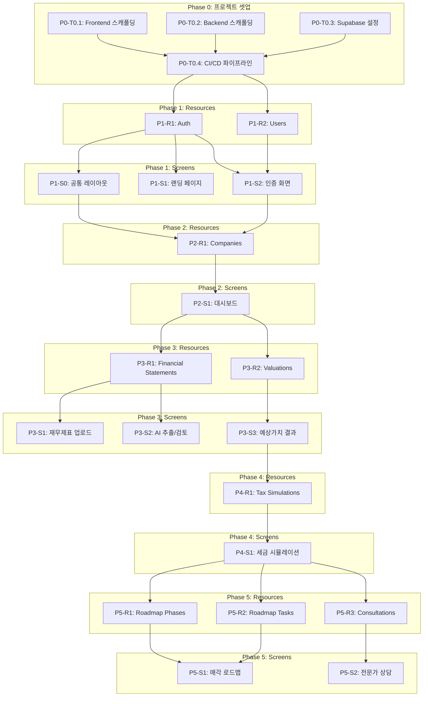

# 06. TASKS.md - 승계브릿지 개발 태스크

> **프로젝트**: 승계브릿지 - 기업승계형 M&A 플랫폼
> **기술 스택**: Next.js 15 (App Router) / FastAPI / Supabase (PostgreSQL)
> **생성일**: 2026-03-26
> **모드**: 문서 기반 (docs/planning/)

---

## 요약

| Phase | 설명 | Resource | Screen | Verification |
|-------|------|----------|--------|-------------|
| P0 | 프로젝트 셋업 | - | - | - |
| P1 | 인증 & 공통 인프라 | R1 (Auth), R2 (Users) | S0 (공통 레이아웃), S1 (랜딩), S2 (인증) | V x2 |
| P2 | 기업 & 대시보드 | R1 (Companies) | S1 (대시보드) | V x1 |
| P3 | 재무제표 & 기업가치 | R1 (Financial Statements), R2 (Valuations) | S1 (업로드), S2 (AI 검토), S3 (결과) | V x3 |
| P4 | 세금 시뮬레이션 | R1 (Tax Simulations) | S1 (세금 시뮬레이션) | V x1 |
| P5 | 로드맵 & 전문가 상담 | R1 (Roadmap Phases), R2 (Roadmap Tasks), R3 (Consultations) | S1 (로드맵), S2 (전문가 상담) | V x2 |
| **합계** | | **10 Resources** | **10 Screens** | **9 Verifications** |

---

## 의존성 그래프

---

# Phase 0: 프로젝트 셋업

### [x] P0-T0.1: Frontend 프로젝트 스캐폴딩
- **담당**: frontend-specialist
- **스펙**: Next.js 15 (App Router) + TypeScript 5.x + Tailwind CSS 4.x + shadcn/ui 초기 설정
- **파일**:
  - `src/app/layout.tsx` (루트 레이아웃)
  - `src/app/globals.css` (글로벌 스타일)
  - `tsconfig.json` (strict 모드)
  - `tailwind.config.ts`
  - `package.json`
- **포함 항목**:
  - Zustand 5.x, TanStack Query 5.x, React Hook Form + Zod 설치
  - Recharts 2.x 설치
  - ESLint flat config + Prettier 설정
  - vitest + React Testing Library 설정
  - 디자인 시스템 컬러 토큰 (Navy, Gold, Green 팔레트 - `05-design-system.md` 참조)
- **병렬**: P0-T0.2, P0-T0.3과 병렬 가능

### [x] P0-T0.2: Backend 프로젝트 스캐폴딩
- **담당**: backend-specialist
- **스펙**: FastAPI + Python 3.14+ 프로젝트 초기화
- **파일**:
  - `backend/app/main.py` (FastAPI 엔트리포인트)
  - `backend/app/core/config.py` (pydantic-settings)
  - `backend/app/core/security.py` (JWT 검증)
  - `backend/app/core/exceptions.py` (커스텀 예외)
  - `backend/pyproject.toml`
  - `backend/Dockerfile`
- **포함 항목**:
  - SQLAlchemy 2.0+ async 설정
  - Alembic 마이그레이션 초기화
  - Celery + Redis 워커 설정
  - ruff format + ruff check + mypy strict 설정
  - pytest + httpx 설정
  - 표준 응답 모델 (`{ data, pagination, error }`)
- **병렬**: P0-T0.1, P0-T0.3과 병렬 가능

### [x] P0-T0.3: Supabase 프로젝트 설정
- **담당**: database-specialist
- **스펙**: Supabase 프로젝트 초기화 및 DB 스키마 마이그레이션
- **파일**:
  - `supabase/migrations/001_initial_schema.sql`
  - `backend/app/db/supabase.py` (Supabase 클라이언트)
  - `src/lib/supabase/client.ts` (브라우저 클라이언트)
  - `src/lib/supabase/server.ts` (서버 클라이언트)
- **포함 항목**:
  - 전체 테이블 생성 (users, companies, financial_statements, valuations, tax_simulations, roadmap_phases, roadmap_tasks, consultation_requests)
  - RLS 정책 설정 (사용자별 데이터 격리)
  - 인덱스 생성 (`04-database-design.md` 참조)
  - Supabase Auth 설정 (이메일/비밀번호 + Google OAuth)
  - Supabase Storage 버킷 설정 (financial-documents)
- **병렬**: P0-T0.1, P0-T0.2와 병렬 가능

### [x] P0-T0.4: CI/CD 파이프라인
- **담당**: backend-specialist
- **의존**: P0-T0.1, P0-T0.2, P0-T0.3
- **스펙**: GitHub Actions CI/CD 설정
- **파일**:
  - `.github/workflows/ci.yml`
  - `.github/workflows/deploy.yml`
- **포함 항목**:
  - Frontend: lint → type-check → test → build
  - Backend: ruff check → mypy → pytest → docker build
  - PR 시 자동 테스트, main 머지 시 자동 배포

---

# Phase 1: 인증 & 공통 인프라

## Resource 태스크

### P1-R1: Auth Resource

#### [x] P1-R1-T1: Auth API 구현
- **담당**: backend-specialist
- **리소스**: auth
- **엔드포인트**:
  - POST /api/v1/auth/signup (회원가입)
  - POST /api/v1/auth/login (로그인)
  - POST /api/v1/auth/logout (로그아웃)
  - POST /api/v1/auth/refresh (토큰 갱신)
  - POST /api/v1/auth/forgot-password (비밀번호 찾기)
  - GET /api/v1/auth/me (현재 사용자 정보)
- **필드**: email, password, name, phone, role
- **파일**: `backend/tests/api/test_auth.py` → `backend/app/api/v1/routes/auth.py`
- **스펙**: Supabase Auth 연동, JWT 토큰 검증 미들웨어, Google OAuth 콜백
- **Worktree**: `worktree/phase-1-auth`
- **TDD**: RED → GREEN → REFACTOR
- **헌법**: `docs/planning/07-coding-convention.md` API 설계 규칙 준수
- **병렬**: P1-R2-T1과 병렬 가능

### P1-R2: Users Resource

#### [x] P1-R2-T1: Users API 구현
- **담당**: backend-specialist
- **리소스**: users
- **엔드포인트**:
  - GET /api/v1/users/me (내 프로필)
  - PATCH /api/v1/users/me (프로필 수정)
- **필드**: id, email, name, role, phone, company_name, bio, avatar_url, is_active, last_login_at
- **인증**: 필수
- **파일**: `backend/tests/api/test_users.py` → `backend/app/api/v1/routes/users.py`
- **스펙**: 사용자 프로필 조회/수정 (CEO, Expert 역할 구분)
- **Worktree**: `worktree/phase-1-auth`
- **TDD**: RED → GREEN → REFACTOR
- **헌법**: `docs/planning/07-coding-convention.md` API 설계 규칙 준수
- **병렬**: P1-R1-T1과 병렬 가능

---

## Screen 태스크

### P1-S0: 공통 레이아웃

#### [x] P1-S0-T1: 공통 레이아웃 UI 구현
- **담당**: frontend-specialist
- **화면**: 전체 (대시보드 이후)
- **컴포넌트**:
  - Header (로고, 사용자 메뉴, 로그아웃)
  - Sidebar (네비게이션: 대시보드, 기업가치, 세금, 로드맵, 상담)
  - Footer (회사 정보, 이용약관, 개인정보처리방침)
  - FloatingCTAButton (우측 하단 "상담 요청" 플로팅 버튼)
- **데이터 요구**: users (auth/me)
- **파일**: `src/components/layouts/__tests__/dashboard-layout.test.tsx` → `src/app/(dashboard)/layout.tsx`
- **스펙**: 반응형 레이아웃 (모바일 우선), 사이드바 토글, 60대+ 대형 UI (최소 16px), 인증 미들웨어 (미인증 → /auth 리다이렉트)
- **Worktree**: `worktree/phase-1-layout`
- **TDD**: RED → GREEN → REFACTOR
- **데모**: `/demo/phase-1/s0-layout`
- **데모 상태**: desktop, mobile, sidebar-collapsed
- **의존**: P1-R1-T1

### P1-S1: 랜딩 페이지

> 화면: `/`
> 데이터 요구: 없음 (정적 콘텐츠)

#### [x] P1-S1-T1: 랜딩 페이지 UI 구현
- **담당**: frontend-specialist
- **화면**: `/`
- **컴포넌트**:
  - HeroSection (헤드라인 + CTA 버튼)
  - ProcessSteps (3단계 프로세스 카드: 가치 산정 → 세금 비교 → 로드맵)
  - TrustIndicators (통계 수치: 거래 건수, 절세 금액)
  - FAQAccordion (자주 묻는 질문 아코디언)
  - LandingFooter (회사 정보, 링크)
- **데이터 요구**: 없음 (정적 데이터)
- **파일**: `src/app/__tests__/landing.test.tsx` → `src/app/page.tsx`
- **스펙**: SEO 최적화 (SSG), 히어로 CTA → /auth 이동, FAQ 아코디언 토글, 반응형
- **Worktree**: `worktree/phase-1-landing`
- **TDD**: RED → GREEN → REFACTOR
- **데모**: `/demo/phase-1/s1-landing`
- **데모 상태**: desktop, mobile
- **병렬**: P1-S2-T1과 병렬 가능

#### [x] P1-S1-T2: 랜딩 페이지 통합 테스트
- **담당**: test-specialist
- **화면**: `/`
- **시나리오**:
  | 이름 | When | Then |
  |------|------|------|
  | CTA 클릭 | 히어로 CTA 버튼 클릭 | /auth로 이동 |
  | FAQ 토글 | FAQ 항목 클릭 | 답변 펼침/접힘 |
  | 반응형 | 모바일 뷰포트 | 레이아웃 유지 |
- **파일**: `tests/e2e/landing.spec.ts`
- **Worktree**: `worktree/phase-1-landing`

#### [x] P1-S1-V: 랜딩 페이지 연결점 검증
- **담당**: test-specialist
- **화면**: `/`
- **검증 항목**:
  - [ ] Navigation: HeroSection CTA → /auth 라우트 존재
  - [ ] Navigation: 로그인 버튼 → /auth 라우트 존재
  - [ ] Navigation: FloatingCTAButton → /consultation 라우트 존재
  - [ ] SEO: meta title, description 존재

### P1-S2: 인증 화면

> 화면: `/auth`
> 데이터 요구: auth (signup, login)

#### [x] P1-S2-T1: 인증 화면 UI 구현
- **담당**: frontend-specialist
- **화면**: `/auth`
- **컴포넌트**:
  - AuthTabs (회원가입 / 로그인 탭 전환)
  - LoginForm (이메일 + 비밀번호 + 로그인 버튼)
  - RegisterForm (이메일 + 비밀번호 + 이름 + 약관동의 + 회원가입 버튼)
  - SocialLoginButton (Google OAuth)
  - ForgotPasswordModal (비밀번호 재설정 이메일 발송)
- **데이터 요구**: auth (signup, login, forgot-password)
- **파일**: `src/app/(auth)/__tests__/auth-page.test.tsx` → `src/app/(auth)/login/page.tsx`
- **스펙**: 이메일 유효성 검사, 비밀번호 최소 8자, 표시/숨김 토글, 약관 동의 체크, 인증 성공 → /dashboard 리다이렉트, 이미 로그인 → /dashboard 리다이렉트
- **Worktree**: `worktree/phase-1-auth`
- **TDD**: RED → GREEN → REFACTOR
- **데모**: `/demo/phase-1/s2-auth`
- **데모 상태**: login-tab, register-tab, forgot-password-modal, error
- **의존**: P1-R1-T1, P1-R2-T1

#### [x] P1-S2-T2: 인증 화면 통합 테스트
- **담당**: test-specialist
- **화면**: `/auth`
- **시나리오**:
  | 이름 | When | Then |
  |------|------|------|
  | 회원가입 성공 | 유효 정보 입력 → 회원가입 클릭 | /dashboard 이동 |
  | 로그인 성공 | 유효 이메일/비밀번호 → 로그인 클릭 | /dashboard 이동 |
  | 잘못된 비밀번호 | 틀린 비밀번호 → 로그인 클릭 | 에러 메시지 표시 |
  | 탭 전환 | 회원가입/로그인 탭 클릭 | 폼 전환 |
- **파일**: `tests/e2e/auth.spec.ts`
- **Worktree**: `worktree/phase-1-auth`

#### [x] P1-S2-V: 인증 화면 연결점 검증
- **담당**: test-specialist
- **화면**: `/auth`
- **검증 항목**:
  - [ ] Endpoint: POST /api/v1/auth/signup 응답 정상
  - [ ] Endpoint: POST /api/v1/auth/login 응답 정상
  - [ ] Navigation: 인증 성공 → /dashboard 라우트 존재
  - [ ] Auth: 미인증 보호 페이지 접근 → /auth 리다이렉트

---

# Phase 2: 기업 & 대시보드

## Resource 태스크

### P2-R1: Companies Resource

#### [x] P2-R1-T1: Companies API 구현
- **담당**: backend-specialist
- **리소스**: companies
- **엔드포인트**:
  - GET /api/v1/companies (내 기업 목록)
  - GET /api/v1/companies/{company_id} (기업 상세)
  - POST /api/v1/companies (기업 등록)
  - PATCH /api/v1/companies/{company_id} (기업 수정)
  - DELETE /api/v1/companies/{company_id} (기업 삭제)
- **필드**: id, user_id, company_name, registration_number, industry, founded_year, employee_count, annual_revenue, description, website, logo_url, status, metadata
- **인증**: 필수 (RLS: user_id = auth.uid())
- **파일**: `backend/tests/api/test_companies.py` → `backend/app/api/v1/routes/companies.py`
- **스펙**: 기업 CRUD, RLS 기반 데이터 격리, 상태 관리 (draft → in_progress → completed)
- **Worktree**: `worktree/phase-2-company`
- **TDD**: RED → GREEN → REFACTOR
- **헌법**: `docs/planning/07-coding-convention.md` API 설계 규칙 준수

---

## Screen 태스크

### P2-S1: 대시보드 화면

> 화면: `/dashboard`
> 데이터 요구: users, companies, valuations, tax_simulations, roadmap_phases, consultation_requests

#### [x] P2-S1-T1: 대시보드 UI 구현
- **담당**: frontend-specialist
- **화면**: `/dashboard`
- **컴포넌트**:
  - SummaryCard (기업가치 / 세금 / 로드맵 진행률 / 상담 상태 요약)
  - QuickActionButtons (기업가치 산정, 세금 시뮬레이션, 로드맵 보기, 상담 요청)
  - RecentActivityTimeline (최근 활동 이력)
  - WelcomeBanner (사용자 이름 + 안내 메시지)
- **데이터 요구**: users, companies (Mock: 나머지 리소스는 P3~P5에서 연결)
- **파일**: `src/app/(dashboard)/__tests__/dashboard.test.tsx` → `src/app/(dashboard)/page.tsx`
- **스펙**: 요약 카드 4개 (미완료 시 "시작하기" 상태), 빠른 액션 버튼, 최근 활동 타임라인, 반응형, 대형 UI
- **Worktree**: `worktree/phase-2-dashboard`
- **TDD**: RED → GREEN → REFACTOR
- **데모**: `/demo/phase-2/s1-dashboard`
- **데모 상태**: loading, empty (신규 사용자), normal (데이터 있음)
- **의존**: P2-R1-T1, P1-S0-T1

#### [x] P2-S1-T2: 대시보드 통합 테스트
- **담당**: test-specialist
- **화면**: `/dashboard`
- **시나리오**:
  | 이름 | When | Then |
  |------|------|------|
  | 신규 사용자 | 기업 미등록 상태 | "기업가치 산정 시작" 카드 표시 |
  | 기업가치 카드 클릭 | 카드 클릭 | /valuation/upload 이동 |
  | 빠른 액션 | 버튼 클릭 | 해당 화면 이동 |
- **파일**: `tests/e2e/dashboard.spec.ts`
- **Worktree**: `worktree/phase-2-dashboard`

#### [x] P2-S1-V: 대시보드 연결점 검증
- **담당**: test-specialist
- **화면**: `/dashboard`
- **검증 항목**:
  - [ ] Field Coverage: companies.[id, company_name, status] 존재
  - [ ] Endpoint: GET /api/v1/companies 응답 정상
  - [ ] Navigation: 기업가치 카드 → /valuation/upload 라우트 존재
  - [ ] Navigation: 세금 카드 → /tax-simulation 라우트 존재
  - [ ] Navigation: 로드맵 카드 → /roadmap 라우트 존재
  - [ ] Navigation: 상담 카드 → /consultation 라우트 존재
  - [ ] Auth: 미인증 접근 → /auth 리다이렉트

---

# Phase 3: 재무제표 & 기업가치

## Resource 태스크

### P3-R1: Financial Statements Resource

#### [x] P3-R1-T1: Financial Statements API 구현
- **담당**: backend-specialist
- **리소스**: financial_statements
- **엔드포인트**:
  - GET /api/v1/companies/{company_id}/financial-statements (목록)
  - GET /api/v1/companies/{company_id}/financial-statements/{id} (상세)
  - POST /api/v1/companies/{company_id}/financial-statements/upload (파일 업로드)
  - PATCH /api/v1/companies/{company_id}/financial-statements/{id} (수치 수정)
  - DELETE /api/v1/companies/{company_id}/financial-statements/{id} (삭제)
  - POST /api/v1/companies/{company_id}/financial-statements/{id}/extract (AI 추출 시작)
  - GET /api/v1/companies/{company_id}/financial-statements/{id}/extraction-status (추출 상태 조회)
- **필드**: id, company_id, fiscal_year, quarter, statement_type, file_url, extracted_data, revenue, operating_income, net_income, ebitda, total_assets, total_liabilities, equity, extraction_status, extraction_error
- **인증**: 필수
- **파일**: `backend/tests/api/test_financials.py` → `backend/app/api/v1/routes/financials.py`
- **스펙**: Supabase Storage 파일 업로드 (PDF/Excel, 최대 50MB), AI 추출 Celery 태스크 트리거, 추출 상태 폴링, CEO 수치 수정
- **Worktree**: `worktree/phase-3-valuation`
- **TDD**: RED → GREEN → REFACTOR
- **헌법**: `docs/planning/07-coding-convention.md` API 설계 규칙 준수
- **병렬**: P3-R2-T1과 병렬 가능

#### [x] P3-R1-T2: AI 재무제표 파싱 엔진
- **담당**: backend-specialist
- **스펙**: PDF/Excel 파싱 + GPT-4o 구조화 추출 파이프라인
- **파일**: `backend/tests/domain/test_financial_parser.py` → `backend/app/domain/financial/`
- **포함 항목**:
  - `pdf_parser.py`: pdfplumber 텍스트 추출
  - `excel_parser.py`: openpyxl 셀 데이터 추출
  - `ai_extractor.py`: GPT-4o Vision 구조화 추출 (JSON 출력)
  - `ocr_processor.py`: Tesseract OCR (스캔 PDF fallback)
  - 신뢰도 점수 (0~1) 항목별 반환
  - 회계 항등식 검증 (자산 = 부채 + 자본)
  - Celery 비동기 태스크 래퍼
- **Worktree**: `worktree/phase-3-valuation`
- **TDD**: RED → GREEN → REFACTOR

### P3-R2: Valuations Resource

#### [x] P3-R2-T1: Valuations API 구현
- **담당**: backend-specialist
- **리소스**: valuations
- **엔드포인트**:
  - GET /api/v1/companies/{company_id}/valuations (목록)
  - GET /api/v1/companies/{company_id}/valuations/{id} (상세)
  - POST /api/v1/companies/{company_id}/valuations (산정 실행)
  - GET /api/v1/valuations/industry-multiples (업종별 멀티플 조회)
- **필드**: id, company_id, valuation_date, fiscal_year, ebitda_amount, ebitda_multiple, valuation_result, industry_multiple_avg, valuation_range_low, valuation_range_high, notes
- **인증**: 필수
- **파일**: `backend/tests/api/test_valuations.py` → `backend/app/api/v1/routes/valuations.py`
- **스펙**: EBITDA 정상화 + 멀티플 기반 가치 산정, 보수적/중립/낙관 3시나리오, PDF 리포트 생성
- **Worktree**: `worktree/phase-3-valuation`
- **TDD**: RED → GREEN → REFACTOR
- **헌법**: `docs/planning/07-coding-convention.md` API 설계 규칙 준수
- **병렬**: P3-R1-T1과 병렬 가능

#### [x] P3-R2-T2: EBITDA 정상화 & 멀티플 엔진
- **담당**: backend-specialist
- **스펙**: EBITDA 정상화 알고리즘 + 업종별 멀티플 산정
- **파일**: `backend/tests/domain/test_valuation_engine.py` → `backend/app/domain/valuation/`
- **포함 항목**:
  - `ebitda_normalizer.py`: 오너 초과 급여, 일회성 비용, 특수관계자 거래, 비영업 자산/부채, 감가상각 정상화
  - `multiple_engine.py`: EV/EBITDA 멀티플 기반 가치 산정 (보수적 4x, 중립 6x, 낙관 8x 범위)
  - `multiple_db.py`: 업종별 멀티플 데이터 (한국거래소 기반)
- **Worktree**: `worktree/phase-3-valuation`
- **TDD**: RED → GREEN → REFACTOR

---

## Screen 태스크

### P3-S1: 재무제표 업로드 화면

> 화면: `/valuation/upload`
> 데이터 요구: financial_statements (upload)

#### [x] P3-S1-T1: 재무제표 업로드 UI 구현
- **담당**: frontend-specialist
- **화면**: `/valuation/upload`
- **컴포넌트**:
  - DragDropUploadZone (드래그앤드롭 파일 업로드 영역)
  - UploadProgressBar (업로드 진행률 표시)
  - UploadedFileList (업로드 완료 파일 목록 + 삭제 버튼)
  - UploadGuide (업로드 가이드: 어떤 서류를 업로드해야 하는지)
  - FormatInfo (지원 포맷 안내: PDF, Excel)
- **데이터 요구**: financial_statements (upload, extraction-status)
- **파일**: `src/app/(dashboard)/valuation/upload/__tests__/upload.test.tsx` → `src/app/(dashboard)/valuation/upload/page.tsx`
- **스펙**: 드래그앤드롭 + 클릭 업로드, 진행률 표시, 파일 삭제, "AI 추출 시작" 버튼 → /valuation/review 이동, 최대 50MB 파일 크기 제한
- **Worktree**: `worktree/phase-3-screens`
- **TDD**: RED → GREEN → REFACTOR
- **데모**: `/demo/phase-3/s1-upload`
- **데모 상태**: loading, empty, uploading, uploaded, error
- **의존**: P3-R1-T1

#### [x] P3-S1-T2: 재무제표 업로드 통합 테스트
- **담당**: test-specialist
- **화면**: `/valuation/upload`
- **시나리오**:
  | 이름 | When | Then |
  |------|------|------|
  | 파일 업로드 | PDF 파일 드롭 | 업로드 진행률 표시 → 완료 |
  | 파일 삭제 | 삭제 버튼 클릭 | 파일 목록에서 제거 |
  | AI 추출 시작 | "AI 추출 시작" 클릭 | /valuation/review 이동 |
  | 파일 크기 초과 | 50MB 초과 파일 업로드 시도 | 에러 메시지 표시 |
- **파일**: `tests/e2e/upload.spec.ts`
- **Worktree**: `worktree/phase-3-screens`

#### [x] P3-S1-V: 재무제표 업로드 연결점 검증
- **담당**: test-specialist
- **화면**: `/valuation/upload`
- **검증 항목**:
  - [ ] Endpoint: POST /api/v1/companies/{id}/financial-statements/upload 응답 정상
  - [ ] Endpoint: POST /api/v1/companies/{id}/financial-statements/{id}/extract 응답 정상
  - [ ] Navigation: "AI 추출 시작" → /valuation/review 라우트 존재
  - [ ] Navigation: 뒤로가기 → /dashboard 라우트 존재
  - [ ] Auth: 미인증 접근 → /auth 리다이렉트

### P3-S2: AI 추출/검토 화면

> 화면: `/valuation/review`
> 데이터 요구: financial_statements (extracted_data, extraction_status)

#### [x] P3-S2-T1: AI 추출/검토 UI 구현
- **담당**: frontend-specialist
- **화면**: `/valuation/review`
- **컴포넌트**:
  - FinancialDataTable (연도별 추출 결과 편집 가능 테이블)
  - ConfidenceIndicator (항목별 AI 추출 신뢰도 표시: 높음/중간/낮음)
  - NormalizationChecklist (사적비용 항목 체크: 오너 급여, 개인차량비 등)
  - IndustrySelector (업종 선택 드롭다운)
  - OriginalFilePreview (원본 파일 미리보기 사이드 패널)
  - ExtractionLoadingState (AI 분석 중 로딩 화면)
- **데이터 요구**: financial_statements (extracted_data, extraction_status, file_url)
- **파일**: `src/app/(dashboard)/valuation/review/__tests__/review.test.tsx` → `src/app/(dashboard)/valuation/review/page.tsx`
- **스펙**: 추출 결과 인라인 편집, 사적비용 체크 시 정상화 EBITDA 실시간 재계산, 업종 선택, 원본 파일 사이드 패널 비교, "가치 산정 보기" → /valuation/result 이동
- **Worktree**: `worktree/phase-3-screens`
- **TDD**: RED → GREEN → REFACTOR
- **데모**: `/demo/phase-3/s2-review`
- **데모 상태**: loading (AI 분석 중), completed (추출 완료), editing (수치 수정 중), error
- **의존**: P3-R1-T1, P3-R1-T2

#### [x] P3-S2-T2: AI 추출/검토 통합 테스트
- **담당**: test-specialist
- **화면**: `/valuation/review`
- **시나리오**:
  | 이름 | When | Then |
  |------|------|------|
  | 추출 결과 표시 | 페이지 로드 | 연도별 재무 수치 테이블 표시 |
  | 수치 수정 | 셀 클릭 → 값 수정 | 인라인 편집 → 저장 |
  | 사적비용 체크 | 오너 급여 체크박스 | 정상화 EBITDA 재계산 |
  | 업종 선택 | 드롭다운 선택 | 업종 상태 업데이트 |
  | 가치 산정 | "가치 산정 보기" 클릭 | /valuation/result 이동 |
- **파일**: `tests/e2e/review.spec.ts`
- **Worktree**: `worktree/phase-3-screens`

#### [x] P3-S2-V: AI 추출/검토 연결점 검증
- **담당**: test-specialist
- **화면**: `/valuation/review`
- **검증 항목**:
  - [ ] Field Coverage: financial_statements.[fiscal_year, revenue, operating_income, ebitda, extraction_status, extracted_data] 존재
  - [ ] Endpoint: GET /api/v1/companies/{id}/financial-statements/{id} 응답 정상
  - [ ] Endpoint: PATCH /api/v1/companies/{id}/financial-statements/{id} 응답 정상
  - [ ] Navigation: "가치 산정 보기" → /valuation/result 라우트 존재
  - [ ] Navigation: "파일 다시 업로드" → /valuation/upload 라우트 존재

### P3-S3: 예상가치 결과 화면

> 화면: `/valuation/result`
> 데이터 요구: valuations, financial_statements

#### [x] P3-S3-T1: 예상가치 결과 UI 구현
- **담당**: frontend-specialist
- **화면**: `/valuation/result`
- **컴포넌트**:
  - NormalizedEBITDAComparison (정상화 전/후 EBITDA 비교 표시)
  - IndustryMultipleRange (업종별 멀티플 범위 바)
  - ValuationRangeChart (예상 기업가치 범위 바 차트 - Recharts)
  - ValuationSummaryCard (보수적/중립/낙관 시나리오 수치 카드)
  - ValuationBasis (산정 기준 설명)
  - PDFDownloadButton (결과 리포트 PDF 다운로드)
- **데이터 요구**: valuations (valuation_result, valuation_range_low, valuation_range_high, ebitda_amount, ebitda_multiple, industry_multiple_avg)
- **파일**: `src/app/(dashboard)/valuation/result/__tests__/result.test.tsx` → `src/app/(dashboard)/valuation/result/page.tsx`
- **스펙**: EBITDA 정상화 전/후 비교, 멀티플 범위 시각화, 3시나리오 기업가치 범위 차트, PDF 다운로드, "세금 시뮬레이션 보기" CTA → /tax-simulation 이동, 금액 표시 24px+ (Gold-600 컬러)
- **Worktree**: `worktree/phase-3-screens`
- **TDD**: RED → GREEN → REFACTOR
- **데모**: `/demo/phase-3/s3-result`
- **데모 상태**: loading, normal, pdf-generating
- **의존**: P3-R2-T1, P3-R2-T2

#### [x] P3-S3-T2: 예상가치 결과 통합 테스트
- **담당**: test-specialist
- **화면**: `/valuation/result`
- **시나리오**:
  | 이름 | When | Then |
  |------|------|------|
  | 결과 표시 | 페이지 로드 | 기업가치 범위 차트 표시 |
  | PDF 다운로드 | "PDF 저장" 클릭 | PDF 파일 다운로드 |
  | 세금 시뮬레이션 | "세금 시뮬레이션 보기" 클릭 | /tax-simulation 이동 |
  | 수치 수정 | "수치 수정하기" 클릭 | /valuation/review 이동 |
- **파일**: `tests/e2e/valuation-result.spec.ts`
- **Worktree**: `worktree/phase-3-screens`

#### [x] P3-S3-V: 예상가치 결과 연결점 검증
- **담당**: test-specialist
- **화면**: `/valuation/result`
- **검증 항목**:
  - [ ] Field Coverage: valuations.[valuation_result, valuation_range_low, valuation_range_high, ebitda_amount, ebitda_multiple] 존재
  - [ ] Endpoint: GET /api/v1/companies/{id}/valuations/{id} 응답 정상
  - [ ] Endpoint: GET /api/v1/valuations/industry-multiples 응답 정상
  - [ ] Navigation: "세금 시뮬레이션 보기" → /tax-simulation 라우트 존재
  - [ ] Navigation: "수치 수정하기" → /valuation/review 라우트 존재
  - [ ] Navigation: "상담 요청" → /consultation 라우트 존재

---

# Phase 4: 세금 시뮬레이션

## Resource 태스크

### P4-R1: Tax Simulations Resource

#### [x] P4-R1-T1: Tax Simulations API 구현
- **담당**: backend-specialist
- **리소스**: tax_simulations
- **엔드포인트**:
  - GET /api/v1/companies/{company_id}/tax-simulations (목록)
  - GET /api/v1/companies/{company_id}/tax-simulations/{id} (상세)
  - POST /api/v1/companies/{company_id}/tax-simulations (시뮬레이션 실행)
- **필드**: id, company_id, simulation_date, scenario, sale_price, capital_gains_tax, corporate_tax, local_income_tax, health_insurance_contribution, total_tax, net_proceeds, effective_tax_rate, assumptions
- **인증**: 필수
- **파일**: `backend/tests/api/test_tax_simulations.py` → `backend/app/api/v1/routes/tax_simulation.py`
- **스펙**: 4가지 시나리오 (양도세, 상속세, 증여특례, 하이브리드) 동시 계산, 최적 시나리오 추천, 면책 고지 포함
- **Worktree**: `worktree/phase-4-tax`
- **TDD**: RED → GREEN → REFACTOR
- **헌법**: `docs/planning/07-coding-convention.md` API 설계 규칙 준수

#### [x] P4-R1-T2: 세금 계산 엔진
- **담당**: backend-specialist
- **스펙**: 한국 세법 기반 4가지 세금 계산 엔진
- **파일**: `backend/tests/domain/test_tax_engine.py` → `backend/app/domain/tax/`
- **포함 항목**:
  - `capital_gains_tax.py`: 비상장주식 양도소득세 (세율, 공제, 장기보유 특별공제)
  - `inheritance_tax.py`: 상속세 (가업상속공제 포함/미포함)
  - `gift_tax_special.py`: 가업승계 증여특례 (100억 한도, 5년 사후관리)
  - `hybrid_strategy.py`: 양도 + 증여 혼합 최적 비율 산출
  - 법령 기준일 추적 (세법 변경 대응)
- **Worktree**: `worktree/phase-4-tax`
- **TDD**: RED → GREEN → REFACTOR

---

## Screen 태스크

### P4-S1: 세금 시뮬레이션 화면

> 화면: `/tax-simulation`
> 데이터 요구: tax_simulations, valuations

#### [x] P4-S1-T1: 세금 시뮬레이션 UI 구현
- **담당**: frontend-specialist
- **화면**: `/tax-simulation`
- **컴포넌트**:
  - TaxInputForm (CEO 추가 정보: 지분율, 취득가액, 보유기간, 가족관계, 중소기업 해당 여부)
  - ScenarioComparisonTable (4가지 시나리오 비교 표)
  - ScenarioBarChart (시나리오별 세액 바 차트 - Recharts)
  - OptimalStrategyHighlight (최적 시나리오 강조 배경색)
  - TaxBasisInfo (세금 계산 기준 안내)
  - DisclaimerBanner (면책 고지: "본 시뮬레이션은 참고용")
  - PDFDownloadButton (비교표 PDF 다운로드)
- **데이터 요구**: tax_simulations (all scenarios), valuations (valuation_result)
- **파일**: `src/app/(dashboard)/tax-simulation/__tests__/tax-simulation.test.tsx` → `src/app/(dashboard)/tax-simulation/page.tsx`
- **스펙**: 4시나리오 비교 표/차트, 세금 적은 시나리오 초록색 강조, 금액 억 단위 표시 (24px+, Gold-600), 면책 고지 상시 노출, "매각 로드맵 시작" CTA → /roadmap 이동
- **Worktree**: `worktree/phase-4-screens`
- **TDD**: RED → GREEN → REFACTOR
- **데모**: `/demo/phase-4/s1-tax-simulation`
- **데모 상태**: loading, input-form, result, error
- **의존**: P4-R1-T1, P4-R1-T2

#### [x] P4-S1-T2: 세금 시뮬레이션 통합 테스트
- **담당**: test-specialist
- **화면**: `/tax-simulation`
- **시나리오**:
  | 이름 | When | Then |
  |------|------|------|
  | 정보 입력 | CEO 정보 입력 후 계산 | 4가지 시나리오 결과 표시 |
  | 시나리오 비교 | 결과 표시 | 최적 시나리오 강조 |
  | 상세 보기 | 시나리오 열 클릭 | 상세 설명 모달 |
  | PDF 다운로드 | "비교표 저장" 클릭 | PDF 다운로드 |
  | 로드맵 이동 | "매각 로드맵 시작" 클릭 | /roadmap 이동 |
- **파일**: `tests/e2e/tax-simulation.spec.ts`
- **Worktree**: `worktree/phase-4-screens`

#### [x] P4-S1-V: 세금 시뮬레이션 연결점 검증
- **담당**: test-specialist
- **화면**: `/tax-simulation`
- **검증 항목**:
  - [ ] Field Coverage: tax_simulations.[scenario, sale_price, capital_gains_tax, total_tax, net_proceeds, effective_tax_rate] 존재
  - [ ] Endpoint: POST /api/v1/companies/{id}/tax-simulations 응답 정상
  - [ ] Endpoint: GET /api/v1/companies/{id}/tax-simulations 응답 정상
  - [ ] Navigation: "매각 로드맵 시작" → /roadmap 라우트 존재
  - [ ] Navigation: "상담 요청" → /consultation 라우트 존재
  - [ ] Navigation: "기업가치 수정" → /valuation/result 라우트 존재

---

# Phase 5: 로드맵 & 전문가 상담

## Resource 태스크

### P5-R1: Roadmap Phases Resource

#### [x] P5-R1-T1: Roadmap Phases API 구현
- **담당**: backend-specialist
- **리소스**: roadmap_phases
- **엔드포인트**:
  - GET /api/v1/companies/{company_id}/roadmap (전체 로드맵 조회)
  - PATCH /api/v1/companies/{company_id}/roadmap/phases/{phase_id} (Phase 상태 수정)
  - POST /api/v1/companies/{company_id}/roadmap/initialize (로드맵 초기 생성)
- **필드**: id, company_id, phase_number, phase_name, description, expected_duration_days, status, started_at, completed_at
- **인증**: 필수
- **파일**: `backend/tests/api/test_roadmap.py` → `backend/app/api/v1/routes/roadmap.py`
- **스펙**: 5개 Phase (준비 → 가치산정 → 매수자탐색 → 협상/계약 → 클로징) 관리, 순차 잠금 (이전 Phase 완료 전 다음 시작 불가)
- **Worktree**: `worktree/phase-5-roadmap`
- **TDD**: RED → GREEN → REFACTOR
- **헌법**: `docs/planning/07-coding-convention.md` API 설계 규칙 준수
- **병렬**: P5-R2-T1, P5-R3-T1과 병렬 가능

### P5-R2: Roadmap Tasks Resource

#### [x] P5-R2-T1: Roadmap Tasks API 구현
- **담당**: backend-specialist
- **리소스**: roadmap_tasks
- **엔드포인트**:
  - GET /api/v1/roadmap/phases/{phase_id}/tasks (Phase별 체크리스트)
  - PATCH /api/v1/roadmap/tasks/{task_id} (체크리스트 항목 완료/미완료 토글)
  - GET /api/v1/companies/{company_id}/roadmap/progress (전체 진행률)
- **필드**: id, phase_id, task_order, task_title, description, is_completed, completed_at, priority, due_date, attachments
- **인증**: 필수
- **파일**: `backend/tests/api/test_roadmap_tasks.py` → `backend/app/api/v1/routes/roadmap.py`
- **스펙**: Phase별 체크리스트 CRUD, 완료 토글, 전체 진행률 계산, 문서 템플릿 다운로드 URL 제공
- **Worktree**: `worktree/phase-5-roadmap`
- **TDD**: RED → GREEN → REFACTOR
- **헌법**: `docs/planning/07-coding-convention.md` API 설계 규칙 준수
- **병렬**: P5-R1-T1, P5-R3-T1과 병렬 가능

### P5-R3: Consultations Resource

#### [x] P5-R3-T1: Consultations API 구현
- **담당**: backend-specialist
- **리소스**: consultation_requests
- **엔드포인트**:
  - GET /api/v1/consultations (내 상담 요청 목록)
  - GET /api/v1/consultations/{id} (상담 상세)
  - POST /api/v1/consultations (상담 요청 생성)
  - PATCH /api/v1/consultations/{id} (상담 상태 업데이트)
- **필드**: id, company_id, expert_id, consultation_type, title, description, status, scheduled_date, consultation_date, duration_minutes, outcome, follow_up_required, rating
- **인증**: 필수
- **파일**: `backend/tests/api/test_consultations.py` → `backend/app/api/v1/routes/consultation.py`
- **스펙**: 상담 요청 CRUD, 상태 관리 (pending → accepted → completed/declined), 현재 진행 상황 자동 첨부 (기업가치/세금/로드맵 스냅샷)
- **Worktree**: `worktree/phase-5-consultation`
- **TDD**: RED → GREEN → REFACTOR
- **헌법**: `docs/planning/07-coding-convention.md` API 설계 규칙 준수
- **병렬**: P5-R1-T1, P5-R2-T1과 병렬 가능

---

## Screen 태스크

### P5-S1: 매각 로드맵 화면

> 화면: `/roadmap`
> 데이터 요구: roadmap_phases, roadmap_tasks

#### [x] P5-S1-T1: 매각 로드맵 UI 구현
- **담당**: frontend-specialist
- **화면**: `/roadmap`
- **컴포넌트**:
  - KanbanBoard (Phase 1~5 가로 스크롤 칸반보드)
  - PhaseCard (Phase 카드: 제목, 상태, 예상 기간, 진행률)
  - PhaseDetailPanel (Phase 상세 사이드 패널: 체크리스트 + 템플릿)
  - ChecklistItem (체크 가능한 체크리스트 항목)
  - TemplateDownloadButton (문서 템플릿 다운로드)
  - ProgressBar (전체 진행률 프로그레스바)
  - CurrentPhaseHighlight (현재 Phase 강조)
- **데이터 요구**: roadmap_phases (all phases), roadmap_tasks (per phase)
- **파일**: `src/app/(dashboard)/roadmap/__tests__/roadmap.test.tsx` → `src/app/(dashboard)/roadmap/page.tsx`
- **스펙**: 칸반보드 5개 Phase 시각화, 현재 Phase 강조 (나머지 흐리게), 체크리스트 완료 시 애니메이션, 전체 진행률 프로그레스바, 문서 템플릿 다운로드
- **Worktree**: `worktree/phase-5-screens`
- **TDD**: RED → GREEN → REFACTOR
- **데모**: `/demo/phase-5/s1-roadmap`
- **데모 상태**: loading, empty (초기화 전), phase-1-active, phase-3-active, completed
- **의존**: P5-R1-T1, P5-R2-T1

#### [x] P5-S1-T2: 매각 로드맵 통합 테스트
- **담당**: test-specialist
- **화면**: `/roadmap`
- **시나리오**:
  | 이름 | When | Then |
  |------|------|------|
  | 칸반보드 표시 | 페이지 로드 | 5개 Phase 카드 표시 |
  | 체크리스트 체크 | 체크박스 클릭 | 항목 완료 처리 + 진행률 업데이트 |
  | Phase 상세 | Phase 카드 클릭 | 상세 패널 열기 |
  | 템플릿 다운로드 | 다운로드 버튼 클릭 | 파일 다운로드 |
  | 현재 Phase 강조 | 페이지 로드 | 진행 중 Phase 시각적 강조 |
- **파일**: `tests/e2e/roadmap.spec.ts`
- **Worktree**: `worktree/phase-5-screens`

#### [x] P5-S1-V: 매각 로드맵 연결점 검증
- **담당**: test-specialist
- **화면**: `/roadmap`
- **검증 항목**:
  - [ ] Field Coverage: roadmap_phases.[phase_number, phase_name, status, expected_duration_days] 존재
  - [ ] Field Coverage: roadmap_tasks.[task_title, is_completed, priority] 존재
  - [ ] Endpoint: GET /api/v1/companies/{id}/roadmap 응답 정상
  - [ ] Endpoint: PATCH /api/v1/roadmap/tasks/{id} 응답 정상
  - [ ] Endpoint: GET /api/v1/companies/{id}/roadmap/progress 응답 정상
  - [ ] Navigation: "상담 요청" → /consultation 라우트 존재
  - [ ] Navigation: "대시보드로" → /dashboard 라우트 존재

### P5-S2: 전문가 상담 요청 화면

> 화면: `/consultation`
> 데이터 요구: consultation_requests, users

#### [x] P5-S2-T1: 전문가 상담 요청 UI 구현
- **담당**: frontend-specialist
- **화면**: `/consultation`
- **컴포넌트**:
  - ConsultationTypeSelector (세무 상담 / 법무 상담 / M&A 자문 선택)
  - ConsultationRequestForm (이름, 연락처, 이메일, 상담 내용 폼)
  - AutoAttachPreview (현재 진행 상황 자동 첨부 미리보기 + 제외 옵션)
  - PrivacyConsentCheckbox (개인정보 수집 동의 체크박스)
  - ConsultationHistory (이전 상담 요청 이력 목록)
- **데이터 요구**: consultation_requests, users (auto-fill)
- **파일**: `src/app/(dashboard)/consultation/__tests__/consultation.test.tsx` → `src/app/(dashboard)/consultation/page.tsx`
- **스펙**: 상담 유형 3가지 선택 (진입 화면 기반 사전 선택), 이름/이메일 자동 채움, 현재 진행 상황 자동 첨부, 개인정보 동의 필수, 제출 → /dashboard 이동 + 성공 토스트
- **Worktree**: `worktree/phase-5-screens`
- **TDD**: RED → GREEN → REFACTOR
- **데모**: `/demo/phase-5/s2-consultation`
- **데모 상태**: loading, empty-form, pre-selected-tax, pre-selected-legal, submitted
- **의존**: P5-R3-T1

#### [x] P5-S2-T2: 전문가 상담 통합 테스트
- **담당**: test-specialist
- **화면**: `/consultation`
- **시나리오**:
  | 이름 | When | Then |
  |------|------|------|
  | 유형 선택 | 세무 상담 클릭 | 유형 선택 상태 업데이트 |
  | 자동 채움 | 페이지 로드 | 이름, 이메일 자동 입력 |
  | 상담 신청 | 유효 정보 입력 → 제출 | /dashboard 이동 + 성공 토스트 |
  | 유효성 검사 | 내용 미입력 → 제출 | 에러 메시지 표시 |
  | 자동 첨부 제외 | 첨부 체크박스 해제 | 진행 상황 제외 |
- **파일**: `tests/e2e/consultation.spec.ts`
- **Worktree**: `worktree/phase-5-screens`

#### [x] P5-S2-V: 전문가 상담 연결점 검증
- **담당**: test-specialist
- **화면**: `/consultation`
- **검증 항목**:
  - [ ] Field Coverage: consultation_requests.[consultation_type, title, description, status] 존재
  - [ ] Endpoint: POST /api/v1/consultations 응답 정상
  - [ ] Endpoint: GET /api/v1/consultations 응답 정상
  - [ ] Navigation: 제출 완료 → /dashboard 라우트 존재
  - [ ] Auth: 미인증 접근 → /auth 리다이렉트
  - [ ] Auto-fill: users.name, users.email 자동 채움

---

## 태스크 총괄 요약

| Phase | Task ID | 이름 | 담당 | 의존 |
|-------|---------|------|------|------|
| P0 | P0-T0.1 | Frontend 스캐폴딩 | frontend-specialist | - |
| P0 | P0-T0.2 | Backend 스캐폴딩 | backend-specialist | - |
| P0 | P0-T0.3 | Supabase 설정 | database-specialist | - |
| P0 | P0-T0.4 | CI/CD 파이프라인 | backend-specialist | P0-T0.1~3 |
| P1 | P1-R1-T1 | Auth API | backend-specialist | P0-T0.4 |
| P1 | P1-R2-T1 | Users API | backend-specialist | P0-T0.4 |
| P1 | P1-S0-T1 | 공통 레이아웃 UI | frontend-specialist | P1-R1-T1 |
| P1 | P1-S1-T1 | 랜딩 페이지 UI | frontend-specialist | P0-T0.4 |
| P1 | P1-S1-T2 | 랜딩 페이지 통합 테스트 | test-specialist | P1-S1-T1 |
| P1 | P1-S1-V | 랜딩 페이지 검증 | test-specialist | P1-S1-T2 |
| P1 | P1-S2-T1 | 인증 화면 UI | frontend-specialist | P1-R1-T1, P1-R2-T1 |
| P1 | P1-S2-T2 | 인증 화면 통합 테스트 | test-specialist | P1-S2-T1 |
| P1 | P1-S2-V | 인증 화면 검증 | test-specialist | P1-S2-T2 |
| P2 | P2-R1-T1 | Companies API | backend-specialist | P1-S2-V |
| P2 | P2-S1-T1 | 대시보드 UI | frontend-specialist | P2-R1-T1, P1-S0-T1 |
| P2 | P2-S1-T2 | 대시보드 통합 테스트 | test-specialist | P2-S1-T1 |
| P2 | P2-S1-V | 대시보드 검증 | test-specialist | P2-S1-T2 |
| P3 | P3-R1-T1 | Financial Statements API | backend-specialist | P2-S1-V |
| P3 | P3-R1-T2 | AI 재무제표 파싱 엔진 | backend-specialist | P3-R1-T1 |
| P3 | P3-R2-T1 | Valuations API | backend-specialist | P2-S1-V |
| P3 | P3-R2-T2 | EBITDA 정상화 & 멀티플 | backend-specialist | P3-R2-T1 |
| P3 | P3-S1-T1 | 재무제표 업로드 UI | frontend-specialist | P3-R1-T1 |
| P3 | P3-S1-T2 | 재무제표 업로드 통합 테스트 | test-specialist | P3-S1-T1 |
| P3 | P3-S1-V | 재무제표 업로드 검증 | test-specialist | P3-S1-T2 |
| P3 | P3-S2-T1 | AI 추출/검토 UI | frontend-specialist | P3-R1-T1, P3-R1-T2 |
| P3 | P3-S2-T2 | AI 추출/검토 통합 테스트 | test-specialist | P3-S2-T1 |
| P3 | P3-S2-V | AI 추출/검토 검증 | test-specialist | P3-S2-T2 |
| P3 | P3-S3-T1 | 예상가치 결과 UI | frontend-specialist | P3-R2-T1, P3-R2-T2 |
| P3 | P3-S3-T2 | 예상가치 결과 통합 테스트 | test-specialist | P3-S3-T1 |
| P3 | P3-S3-V | 예상가치 결과 검증 | test-specialist | P3-S3-T2 |
| P4 | P4-R1-T1 | Tax Simulations API | backend-specialist | P3-S3-V |
| P4 | P4-R1-T2 | 세금 계산 엔진 | backend-specialist | P4-R1-T1 |
| P4 | P4-S1-T1 | 세금 시뮬레이션 UI | frontend-specialist | P4-R1-T1, P4-R1-T2 |
| P4 | P4-S1-T2 | 세금 시뮬레이션 통합 테스트 | test-specialist | P4-S1-T1 |
| P4 | P4-S1-V | 세금 시뮬레이션 검증 | test-specialist | P4-S1-T2 |
| P5 | P5-R1-T1 | Roadmap Phases API | backend-specialist | P4-S1-V |
| P5 | P5-R2-T1 | Roadmap Tasks API | backend-specialist | P4-S1-V |
| P5 | P5-R3-T1 | Consultations API | backend-specialist | P4-S1-V |
| P5 | P5-S1-T1 | 매각 로드맵 UI | frontend-specialist | P5-R1-T1, P5-R2-T1 |
| P5 | P5-S1-T2 | 매각 로드맵 통합 테스트 | test-specialist | P5-S1-T1 |
| P5 | P5-S1-V | 매각 로드맵 검증 | test-specialist | P5-S1-T2 |
| P5 | P5-S2-T1 | 전문가 상담 UI | frontend-specialist | P5-R3-T1 |
| P5 | P5-S2-T2 | 전문가 상담 통합 테스트 | test-specialist | P5-S2-T1 |
| P5 | P5-S2-V | 전문가 상담 검증 | test-specialist | P5-S2-T2 |

**총 태스크**: 44개 (P0: 4, P1: 9, P2: 4, P3: 14, P4: 5, P5: 8)

---

## 병렬 실행 가능 그룹

| Phase | 그룹 | 병렬 가능 태스크 |
|-------|------|-----------------|
| P0 | Setup | P0-T0.1, P0-T0.2, P0-T0.3 |
| P1 | Resources | P1-R1-T1, P1-R2-T1 |
| P1 | Screens | P1-S1-T1, P1-S2-T1 (S0 완료 후) |
| P3 | Resources | P3-R1-T1, P3-R2-T1 |
| P3 | Domain | P3-R1-T2, P3-R2-T2 (각 API 완료 후) |
| P3 | Screens | P3-S1-T1 (R1 의존), P3-S3-T1 (R2 의존) → 서로 병렬 가능 |
| P5 | Resources | P5-R1-T1, P5-R2-T1, P5-R3-T1 |
| P5 | Screens | P5-S1-T1, P5-S2-T1 (서로 다른 리소스 의존 → 병렬 가능) |
